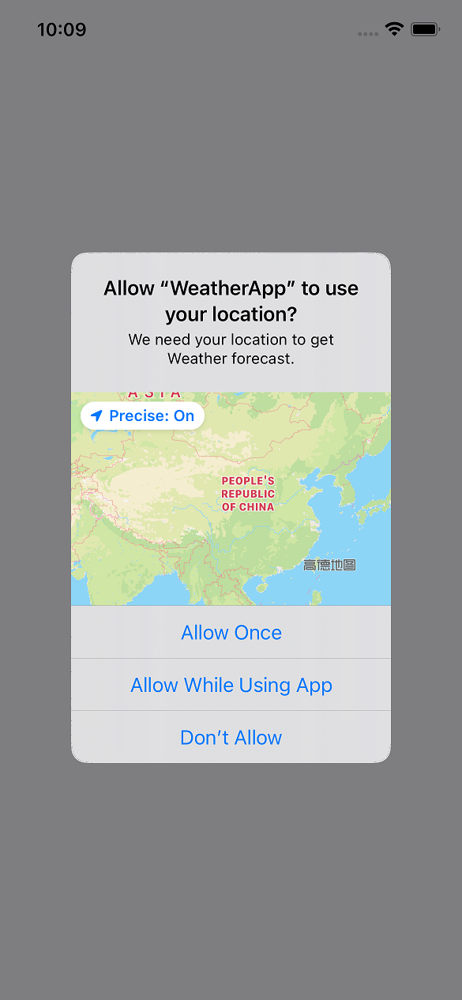
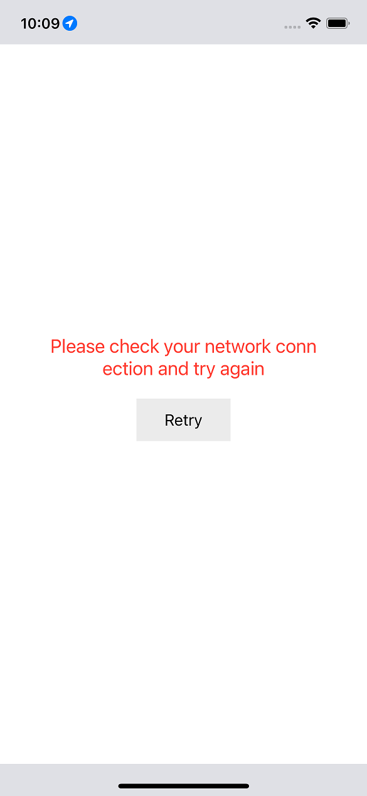
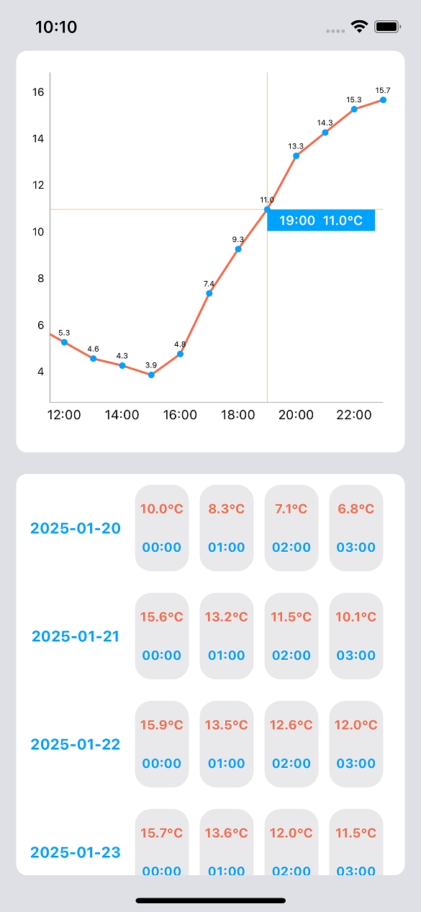

# WeatherApp

iOS WeatherApp

## Introduction

This is a WeatherApp iOS application that uses swift MVVM architecture with RxSwift. Display the current weather data with line Chart and table list based on the user's location.



## Installation

```bash
git clone https://github.com/JIANGUNIQ/WeatherApp.git
cd WeatherApp
pod install
open WeatherApp.xcworkspace
```

## Dependency

- Alamofire
- RxSwift
- Charts
